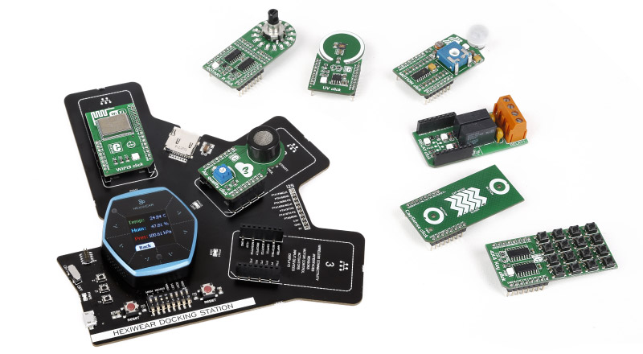

The Hexiwear docking station is an expansion board that has three sockets for 
click boards. There are more than 250 to choose from, and you can see them all 
at the [MikroElektronika website](http://www.mikroe.com/click/). 
